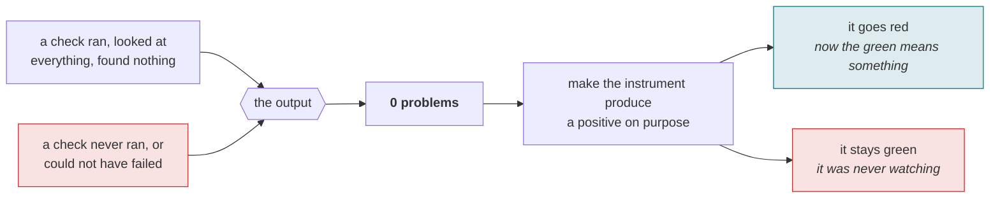
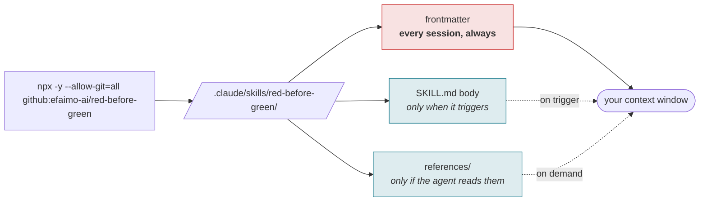
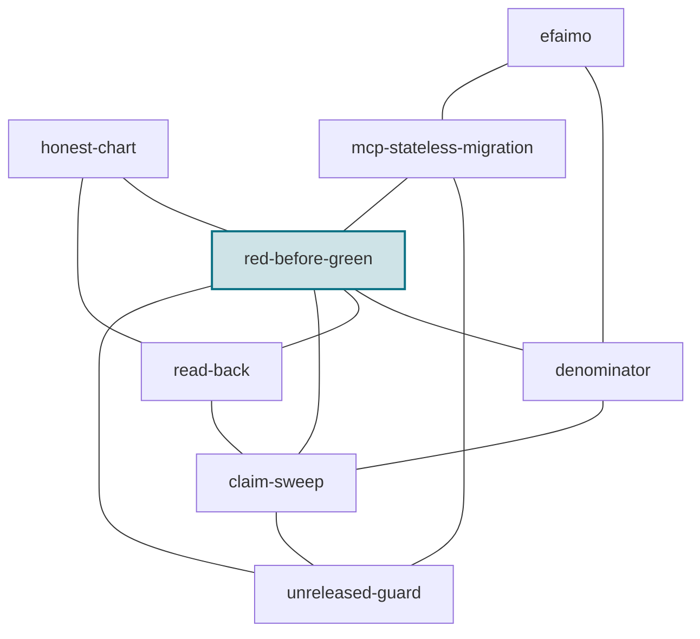

# red-before-green

[](LICENSE)
[-0b7285)](https://efaimo.ai/skills)
[](https://github.com/efaimo-ai/red-before-green/actions/workflows/house-style.yml)

An Agent Skill for the moment a check comes back clean and you are about to
believe it.

A green test, an empty grep, a linter with zero problems, a CI gate that passed,
a subagent that reported "no issues". Each of these is either evidence or a
decoration, and from the outside they look identical. The skill is one move that
tells them apart: before you trust the green, make the check go red on purpose.

<!-- generated:install -->

## Install

```sh
# into ./.claude/skills/red-before-green/
npx -y --allow-git=all github:efaimo-ai/red-before-green

# into ~/.claude/skills/red-before-green/, for every project
npx -y --allow-git=all github:efaimo-ai/red-before-green --global

# installed already, and still current?
npx -y --allow-git=all github:efaimo-ai/red-before-green --check
```

That is the repository, not the registry, and it is deliberate: `red-before-green` is
not on npm yet, and printing `npx red-before-green` today would advertise a command that
404s.

`--allow-git=all` is there because npm 12 refuses git specs by default
(`EALLOWGIT`), and it is the only value that helps: a narrower
`--allow-git=<spec>` is still refused. **You should not enjoy typing it.**
Switching off a protection npm added on purpose is a poor way to install
anything, and the honest alternative is that this skill is markdown: copy
`SKILL.md` and its `references/` into `.claude/skills/red-before-green/` and you are
done, with nothing to trust.

Both of those go away when the package publishes, because `npx red-before-green` needs
no flag on either npm major. This README is regenerated from a committed
registry probe, so that sentence changes itself rather than waiting for someone
to remember it.

The package is the skill: `SKILL.md` and its `references/`, nothing else. The
installer copies them, reads every byte back, and fails if what landed is not
what it wrote. It refuses to overwrite a directory whose contents differ unless
you pass `--force`, and installing the same version twice is a success rather
than a conflict.

Or take it by hand. It is markdown; `npx -y --allow-git=all github:efaimo-ai/red-before-green --print` writes `SKILL.md` to
stdout, and the repository is the whole thing.

<!-- /generated:install -->

## Why a green result is ambiguous



The two paths on the left produce the same bytes. Nothing downstream can tell
them apart, which is why the only way to read a green is to have watched it be
red first.

## The problem

A check that passes and a check that never ran produce the same output: silence.
"0 problems" and "the pattern was misspelled so it matched nothing" are the same
bytes. "All tests pass" and "the test file was never collected" print nearly the
same summary. The most expensive failures are not the ones a check catches - they
are the ones a check was supposed to catch and silently did not, because it was
aimed at the wrong file, ran against an empty set, or was wired to pass no matter
what.

You cannot tell a working check from a broken one by looking at its green. You
can only tell by watching it go red on something you know is bad.

## Install

Claude Code and other agents that read `SKILL.md` from a skills directory:

```bash
git clone --depth 1 https://github.com/efaimo-ai/red-before-green \
  ~/.claude/skills/red-before-green
```

Or vendor the directory anywhere your agent loads skills from. There is nothing
to build and no dependencies.

## What it contains

| file | what it is |
|---|---|
| `SKILL.md` | the move, the tells, and one positive to feed each kind of instrument |
| `references/recipes.md` | per-instrument recipes, each with the trap that hides a non-result |
| `references/failure-gallery.md` | the shapes a vacuous pass takes in the wild |

`SKILL.md` is small on purpose: it is what an agent loads at trigger time. The
references load only when a specific instrument needs them.

## When it fires

A search returns no matches. A test suite, linter, or type-checker reports zero
problems. A CI gate is green. A query comes back with an empty set. A validation
passes. A subagent or tool reports success. In each case, before you conclude the
task is done or report "no issues found", you make the check produce a positive
first.

## The part worth reading even if you never install it

An instrument's silence is not the absence of a problem. It is the absence of a
measurement, and those are only the same thing when the instrument works. The
single most reliable way to earn a green is to have just seen the same instrument
produce a red. A check you have never watched fail is not a check; it is a
comment that happens to be executable.

This generalizes one line that turns up everywhere in careful work - "a guard you
have never seen fail is not a guard" - into a standing discipline that applies to
every clean result, not just the ones you already suspected.

## Scope

This is a procedure, not a linter. There is nothing to run.

It does not tell you your work is correct. It tells you whether the check that
just told you your work is correct can be believed - which is a different, smaller,
and usually skipped question.


<!-- generated:pipeline -->

## What installing it does to a session

A skill is not free just because it is markdown. Its frontmatter is loaded at
the start of every session for every skill you have installed, whether or not it
ever fires.



In this skill's case, measured by [efaimo](https://github.com/efaimo-ai/efaimo) `weigh` (v0.5.0, 2026-09-04):
**97 tokens always resident**, 967 when it triggers, 2,601 across 2 reference files if the agent reads to the end.

<!-- /generated:pipeline -->

<!-- generated:set -->

## The set

Every skill in this set is about a report that was true about the wrong thing.

| skill | something reported | what the report was really about |
|---|---|---|
| **`red-before-green`** | a check said clean | whether it ran at all |
| [`denominator`](https://github.com/efaimo-ai/denominator) | a check said clean | how much of the world it saw |
| [`read-back`](https://github.com/efaimo-ai/read-back) | a write said done | whether it applied |
| [`claim-sweep`](https://github.com/efaimo-ai/claim-sweep) | a change said done | everything else still asserting the old value |
| [`unreleased-guard`](https://github.com/efaimo-ai/unreleased-guard) | a document said true | which version it is true of |
| [`honest-chart`](https://github.com/efaimo-ai/honest-chart) | a picture said the data | whether its geometry is proportional |
| [`mcp-stateless-migration`](https://github.com/efaimo-ai/mcp-stateless-migration) | a server said ok | which revision it speaks |
| [`efaimo`](https://github.com/efaimo-ai/efaimo) | a tool said A(100) | what a grade certifies, and what it costs |



Each edge is a real handoff, not a category: the reason one skill points at
another is written into it at [efaimo.ai/skills](https://efaimo.ai/skills), and
in the `Siblings` section of every `SKILL.md`. All of them are graded and
weighed by [`efaimo`](https://github.com/efaimo-ai/efaimo), the CLI that measures
what an agent loads.

<!-- /generated:set -->

## License

Apache-2.0. See [`LICENSE`](LICENSE) and [`NOTICE`](NOTICE).
